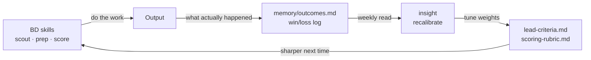
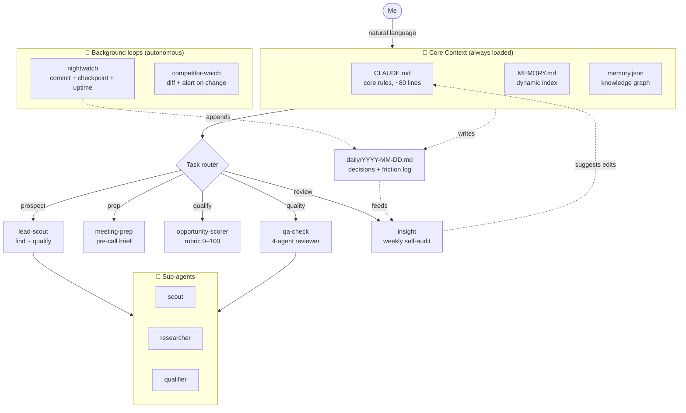

# Partnership & BD Agent System

A file-based, self-maintaining agent system that runs the unglamorous half of a BD job — prospecting, account research, opportunity qualification, competitive intel — on top of a CLI agent (Claude Code; ports to Gemini CLI).

It's not a chatbot wrapper, and it's not a prompt collection. It's a **learning loop**: persistent memory, specialised sub-agents, and a feedback cycle that writes every outcome back into the system so it gets sharper with use — calibrated on *your* deal flow, which is the one thing no competitor can copy.

**Built for mid-to-senior BD professionals** — partnership leads, BD managers and directors who run a real pipeline at an established company. Not solo founders, not indie hackers, not engineers. You don't write code — you fill in a few templates with your ICP, your qualification bar, and the accounts you watch, and the system runs on *your* deal flow.

> **The core idea.** You can outsource a task. You can't outsource the learning. If you just hand the whole job to a model, the thing that gets smarter is the model, not you. When every model is roughly as smart, the edge stops being which one you use. It becomes the compounding curve of your own data and your own way of working, stacked a little higher every time you use it. This repo is one way to build that curve for BD work.

> ⚠️ This is a **sanitised showcase**. All paths, emails and credentials are `<placeholders>`. The point is the *design*, not anyone's pipeline.

---

## Why this exists

Senior BD work is judgment plus a mountain of research busywork: qualifying accounts, prepping for partner calls, scoring inbound, tracking what competitors are up to. Most "AI productivity" setups are one giant prompt — they forget everything between sessions, can't be reused, and break the moment the task gets multi-step.

This is built so the research layer runs itself, you spend your time on the deals, and the system keeps the learning:
- **Remembers** your accounts, criteria and decisions across sessions
- **Specialises** — separate agents for prospecting, research and qualification
- **Runs itself** — monitors competitors and checkpoints work in the background
- **Stays honest** — a built-in critic that grades output against your own bar
- **Compounds** — every outcome (replied / signed / went dead) is written back, and a weekly audit recalibrates your scoring so the machine is sharper next quarter than this one

### The learning loop

You can outsource the task to the agents. You keep the learning — it accumulates in files you own.

---

## Architecture

### The four layers

| Layer | File | Job |
|-------|------|-----|
| **Core rules** | `CLAUDE.md` | Voice, tools, hard constraints. Kept short on purpose. |
| **Dynamic index** | `MEMORY.md` | One line per memory, loaded every session. |
| **Knowledge graph** | `memory.json` | People, projects, tools, relationships. |
| **Daily log** | `daily/*.md` | What happened, what got decided, where I got stuck. |

The loop closes itself: daily logs and `outcomes.md` feed the weekly `insight` audit, which proposes edits back to `CLAUDE.md`, `lead-criteria.md` and `scoring-rubric.md`. The system improves its own instructions and its own scoring.

---

## What's in this repo

Seven reusable skills. Each shows an agent pattern *and* does a real BD/marketing job:

| Skill | Pattern | What it does for you |
|-------|---------|----------------------|
| [`lead-scout`](skills/lead-scout.md) | **Multi-agent research + scoring** | Give it your target profile → finds, qualifies and ranks prospects with sources and a reason-to-reach-out-now |
| [`meeting-prep`](skills/meeting-prep.md) | **Research agent** | One-page brief on a person + company + recent context before any call |
| [`opportunity-scorer`](skills/opportunity-scorer.md) | **Decision rubric** | Scores an inbound deal/partnership 0–100 against your rubric so a yes/no is fast and defensible |
| [`competitor-watch`](skills/competitor-watch.md) | **Autonomous monitor** | Watches competitor messaging, launches, hiring and news on a timer (pricing only if public), pings you only when something changed |
| [`qa-check`](skills/qa-check.md) | **LLM-as-judge** | Four reviewers grade any output against your rules before it ships |
| [`insight`](skills/insight.md) | **Recalibration loop** | Reads daily logs + `outcomes.md` weekly, then tunes your `lead-criteria` and `scoring-rubric` from what actually closed |
| [`nightwatch`](skills/nightwatch.md) | **Autonomous background agent** | Runs on a timer: commits, logs progress, checks your live services |

Every BD skill has a **write-back step** — it logs what happened to `memory/outcomes.md`, which is what feeds the recalibration. That feedback path is the whole point.

### Make it yours (no code)
Fill in the templates and the system runs on *your* pipeline:
- [`templates/CLAUDE.md`](templates/CLAUDE.md) — who you are, your tools, your rules
- [`templates/lead-criteria.md`](templates/lead-criteria.md) — your ideal partner / target account profile
- [`templates/scoring-rubric.md`](templates/scoring-rubric.md) — how you qualify opportunities
- [`templates/watchlist.md`](templates/watchlist.md) — competitors you track

Then just use it — and let `memory/outcomes.md` fill up. See [`memory/EXAMPLE.md`](memory/EXAMPLE.md) for how memory, daily logs, outcomes and the recalibration loop fit together.

---

## Does this need Claude specifically?

No. The architecture is mostly **markdown files + a CLI agent that reads, writes and spawns tools**. Most of it ports to other agentic CLIs (Gemini CLI included). See [PORTING.md](PORTING.md) for the Claude Code ↔ Gemini CLI mapping.

---

## Design principles

1. **Memory is files, not a database.** Plain markdown. Greppable, diffable, version-controlled — and yours.
2. **Short core, deep references.** The always-loaded context stays tiny; detail lives in files loaded on demand.
3. **Specialise, don't centralise.** One agent per job beats one agent for everything.
4. **Never outsource the learning.** Outsource the task to the agents; keep the outcomes. Each cycle, the system is calibrated on your real results — that's the compounding moat, and it can't be copied because it's built from your deal flow, not generic prompts.
